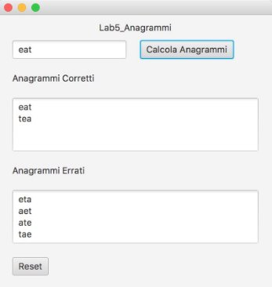

**ESERCIZIO 1** 

**Analizzare su CARTA** l’algoritmo ricorsivo per trovare tutti gli anagrammi di una parola. In particolare, l’algoritmo, dato una parola in input, deve generare in output tutte le permutazioni di tale parola. Una permutazione è una qualsiasi disposizione delle lettere contenute all’interno di una parola. Ad esempio, la parola “eat” ha sei permutazioni (compresa la parola stessa): “eat”, “eta”, “aet”, “ate”, “tea”, “tae”. 

*Figura 1 Struttura base algoritmo ricorsivo*

Rispondere alle seguenti domande: 

- Cosa rappresenta il "livello" nel mio algoritmo ricorsivo? 
- Com'è fatta una soluzione parziale?  
- Come faccio a riconoscere se una soluzione parziale è anche completa? 
- Data una soluzione parziale, come faccio a sapere se è valida o se non è valida?  

(nb. magari non posso) 

- Data una soluzione completa, come faccio a sapere se è valida o se non è valida? 
- Qual è la regola per generare tutte le soluzioni del livello+1 a partire da una soluzione parziale del livello corrente? 
- Qual è la struttura dati per memorizzare una soluzione (parziale o completa)? 
- Qual è la struttura dati per memorizzare lo stato della ricerca (della ricorsione)? 
- Sulla base dello schema presentato in *Fig. 1*, completare i blocchi (alcuni potrebbero essere non necessari) 

- **A** – Condizione di terminazione 
- **B** – Generazione di una nuova soluzione 
- **C** – Filtro sulla chiamata ricorsiva 
- **D** – Backtracking 
- **E** – Sequenza di istruzioni da eseguire sempre 

**ESERCIZIO 2** 

Dopo  aver  fatto  il  *fork*  del  progetto  relativo  a  questo  laboratorio,  realizzare  in  linguaggio  Java un’applicazione dotata di interfaccia grafica (simile a quella presentata in Figura 2) che calcoli tutti gli anagrammi di una parola con l’algoritmo ricorsivo definito nell’esercizio 1. Inoltre, per ogni permutazione della parola, il programma deve controllare se l’anagramma sia valido o meno, controllando la sua esistenza nel database dizionario (file *mark.sql*, disponibile insieme al progetto base). Come riportato in figura, un anagramma valido va mostrato nella prima area di testo, mentre uno non valido va mostrato nella seconda area di testo.  

L’applicazione va sviluppata seguendo il pattern MVC e il pattern DAO per l’accesso al dizionario. 

*Figura 2 Interfaccia grafica per il calcolo degli anagrammi*

Di seguito, una possibile traccia per la soluzione: 

1. Realizzare un’interfaccia grafica con *JavaFx* simile al mockup mostrato in Fig 2. Il pulsante *Reset* permette di cancellare il contenuto di tutti i campi.  
1. Nel modello dell’applicazione, implementare l’algoritmo ricorsivo per il calcolo delle permutazioni di una parola, e testarlo stampando tutti gli anagrammi in una delle due aree di testo. 
1. Importare il database *mark.sql* disponibile con il progetto base (o scaricabile dal sito del corso, sezione  Materiale-Data-Sets-Dizionario-formato  sql).  Per  fare  questo,  avviare  il  database  locale *XAMPP*. Successivamente lanciare il programma *HeidiSQL* e selezionare l’opzione *File -> Carica file SQL*. Selezionare il file *mark.sql*, eseguire la query direttamente (senza caricare nell’editor i dati) per importarlo e cliccare sul tasto *Aggiorna*, per permettere la corretta visualizzazione all’interno dell’elenco del database appena caricato. 
1. Seguendo  il  pattern  DAO,  creare  la  classe  *AnagrammaDAO*,  che  incapsula  le  operazioni  sul database. In particolare, definire in *AnagrammaDAO* il metodo  

public boolean isCorrect(String anagramma) 

che tramite una query SQL permette di verificare se l’anagramma calcolato è presente nel dizionario.
