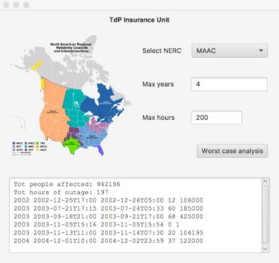
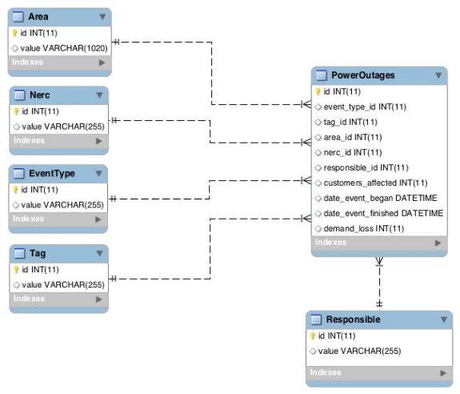


Obiettivi dell’esercitazione:
- Apprendere il meccanismo della ricorsione 
- Utilizzo del pattern MVC, DAO e ORM 
- Utilizzo di JDBC 

**Polizza assicurativa sulle interruzioni di energia** 

Una compagnia assicurativa permette di stipulare delle polizze in territorio statunitense per la copertura dai danni dovuti a possibili interruzioni di energia elettrica. La polizza ha durata di **X** anni e copre fino a **Y** ore totali di disservizio.

Per  effettuare  una  stima  del  premio  assicurativo,  la  compagnia  vuole  prima  fare  un’analisi  del  numero massimo di clienti coinvolti nei blackout che hanno interessato diverse aree degli Stati Uniti negli anni precedenti.

Le informazioni relative ai blackout che si sono verificati dal 2000 al 2014 sono rappresentate nella base dati avente la struttura schematizzata in Figura 3, riportata nell’ultima pagina di questo documento. Il database è denominato *‘poweroutages’* e contiene sei tabelle. La tabella ‘PowerOutages’ contiene le informazioni sulla data di inizio e di fine di ciascun blackout ed una stima delle persone coinvolte (campo *customers\_affected*).

Si  intende  costruire  un’applicazione  JavaFX  che  permetta  di  interrogare  tale  base  dati  e  trovare  la combinazione di eventi di blackout che massimizzi il numero totale di clienti coinvolti.

L’applicazione dovrà svolgere le seguenti funzioni: 

1. Permette  all’utente  di  scegliere  un  NERC  (entità  regionale  deputata  al  controllo  della  rete  di distribuzione dell’energia elettrica), tra quelli presenti nel database, e di inserire il numero massimo di **X** anni e di **Y** ore da considerare per il calcolo della soluzione ottimale 
1. Facendo  click  sul  bottone  “Worst  case  analysis”  l’applicazione  risolve  il  seguente  problema  di ottimizzazione **mediante un algoritmo ricorsivo**: 

selezionare il sottoinsieme di eventi di blackout (tabella ‘PowerOutages’) che si sono verificati in un massimo di **X** anni, per un totale di **Y** ore di disservizio massimo, tale da massimizzare il numero totale di persone coinvolte. In particolare, l’applicazione deve rispettare i seguenti vincoli: 

- Quando si aggiunge un evento di blackout alla lista di eventi selezionati, bisogna considerare tutte le ore di disservizio relative all’evento considerato. Il numero di ore di disservizio viene calcolato come la differenza tra *date\_event\_began* e *date\_event\_finished* 
- Il numero totale di ore di disservizio del sottoinsieme di eventi selezionati deve essere sempre minore o uguale del valore **Y** inserito dall’utente nell’interfaccia grafica 
- La  differenza  tra  l’anno  dell’evento  più  recente  e  l’anno  di  quello  più  vecchio  deve  essere sempre minore o uguale del numero di anni **X** inserito dall’utente nell’interfaccia grafica. 

**ESERCIZIO 2** 

**Analizzare su CARTA** l’algoritmo ricorsivo per trovare la sequenza di balckout che massimizzi il numero di clienti  coinvolti.
Rispondere alle seguenti domande: 

- Cosa rappresenta il "livello" nel mio algoritmo ricorsivo? 
- Com'è fatta una soluzione parziale?  
- Come faccio a riconoscere se una soluzione parziale è anche completa? 
- Data una soluzione parziale, come faccio a sapere se è valida o se non è valida?  (nb. magari non posso) 
- Data una soluzione completa, come faccio a sapere se è valida o se non è valida? 
- Qual è la regola per generare tutte le soluzioni del livello+1 a partire da una soluzione parziale del livello corrente? 
- Qual è la struttura dati per memorizzare una soluzione (parziale o completa)? 
- Qual è la struttura dati per memorizzare lo stato della ricerca (della ricorsione)? 
- Sulla base dello schema presentato in *Fig. 1*, completare i blocchi (alcuni potrebbero essere non necessari) 
- **A** – Condizione di terminazione 
- **B** – Generazione di una nuova soluzione 
- **C** – Filtro sulla chiamata ricorsiva 
- **D** – Backtracking 
- **E** – Sequenza di istruzioni da eseguire sempre 

Dopo aver fatto il *fork* del progetto relativo a questo laboratorio (Lab07), realizzare in linguaggio Java un’applicazione che implementi l’esercizio proposto. L’interfaccia grafica riportata in Figura 2, insieme ad alcuni metodi e classi utili, sono già inclusi nel progetto base. Il database *‘poweroutages’* è incluso nella 

tabella ***db*** del progetto base. 

L’applicazione va sviluppata seguendo il pattern MVC ed il pattern DAO e ORM per l’accesso al database. 

*Figura 2: Interfaccia grafica Laboratorio 07* 

*Figura 3: Diagramma EER del database poweroutages.sql*
