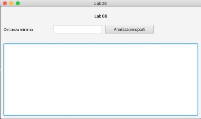

Obiettivi dell’esercitazione: 

- Introduzione ai Grafi 
- Utilizzo della libreria JGraphT 

Dopo aver effettuato il *fork* del progetto relativo all’ottavo laboratorio (Lab08), realizzare in linguaggio Java un’applicazione dotata di interfaccia grafica per calcolare informazioni a proposito dei voli tra i diversi aeroporti. Si consideri, in particolare, il database “extflightdelays”, contenente informazioni su aeroporti, compagnie aeree, orari di partenza e di arrivo dei voli effettuati negli Stati Uniti durante il 2015. Il database (disponibile su Kaggle all’indirizzo:[ https://www.kaggle.com/usdot/flight-delays/data)](https://www.kaggle.com/usdot/flight-delays/data) è strutturato secondo il diagramma ER della pagina seguente.  

L’applicazione dovrà svolgere le seguenti funzioni: 

1. Permettere all’utente di inserire una “distanza media percorsa” minima ***x*** (in miglia) e di selezionare il bottone “Analizza aeroporti”. 
1. Alla pressione del bottone, creare un grafo che rappresenti gli aeroporti collegati da almeno un volo, 

e distanti in media almeno ***x*** miglia. Il grafo deve essere semplice, non orientato e pesato, i vertici devono rappresentare gli aeroporti, mentre gli archi devono indicare le rotte tra gli aeroporti collegati tra di loro da almeno un volo. Il peso dell’arco rappresenta la “distanza media percorsa” tra i due aeroporti, calcolata come la media del campo *DISTANCE* di ciascun volo che li collega (poiché il grafo non è orientato, considerare tutti i voli in entrambe le direzioni: **A->B** e **B->A**). L’arco tra due aeroporti deve essere aggiunto solo se la distanza media percorsa è superiore a ***x**.* Per semplicità, si supponga che le distanze salvate nel database siano già espresse in miglia 

3. Stampare infine nell’area di testo sottostante: 
1. il numero di vertici del grafo; 
1. il numero di archi del grafo; 
1. l’elenco di tutti gli archi con la relativa distanza; 

L’applicazione va sviluppata seguendo il pattern MVC e il pattern DAO per l’accesso al database. 

*Figura 1 Interfaccia grafica del laboratorio n. 8*

*Figura 2 Diagramma Entità-Relazioni del database "extflightdelays"*
